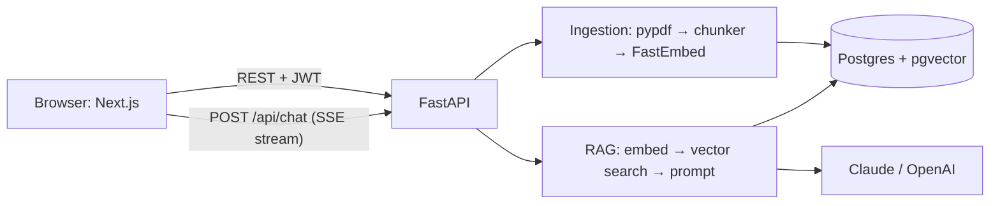

# DocMind AI

Upload PDFs and ask questions about them. Answers stream in token by token, cite the exact document and page they came from, and when the documents don't contain the answer, DocMind says so instead of guessing.

It's a retrieval-augmented generation (RAG) app: FastAPI + PostgreSQL/pgvector on the backend, Next.js on the frontend, local embeddings, and Claude (or OpenAI) for answers.


> _Chat screenshot placeholder: add `docs/screenshots/chat.png` after running with an LLM API key (ask "What is the monthly price of the Vault Business plan?" and open the citation)._

## Features

- **Email/password accounts** with bcrypt hashing and JWT access tokens.
- **PDF upload** (drag and drop, multiple files, 20 MB each) validated by extension, MIME type and magic bytes; ingestion runs in the background with live status.
- **Streaming answers over SSE** with a Stop button, Markdown rendering and conversation history.
- **Citations**: clickable `[1]` markers and chips like `Orbitra_Vault_Product_Guide.pdf · p.1` that open the highlighted source passage.
- **Grounded refusals**: if nothing relevant is retrieved, the LLM isn't even called.
- **Per-document filtering**, saved conversations, follow-up questions.
- **Hardening**: per-user data isolation (IDOR-tested), rate limits, prompt-injection defences, security headers, structured JSON logs with request IDs.

## Architecture



| Layer | Tech |
|---|---|
| Frontend | Next.js 16 (App Router), React 19, TypeScript (strict), Tailwind CSS 4 |
| Backend | Python 3.12, FastAPI, Pydantic v2, SQLAlchemy 2 (async), Alembic |
| Database | PostgreSQL 16 + pgvector (HNSW index, cosine distance) |
| Embeddings | FastEmbed `BAAI/bge-small-en-v1.5` (384-d, local, no API key) |
| LLM | Anthropic Claude (default `claude-opus-5-5`) or OpenAI, via `LLM_PROVIDER` |

Details: [docs/ARCHITECTURE.md](docs/ARCHITECTURE.md) (request flows with file paths) · [docs/DECISIONS.md](docs/DECISIONS.md) (26 architecture decisions and their trade-offs) · [docs/API.md](docs/API.md) (endpoint reference).

## Quick start

Prerequisites: Docker with Compose v2, `make`, and an Anthropic (or OpenAI) API key.

1. **Configure:** `cp .env.example .env`, then set `ANTHROPIC_API_KEY` and a random `JWT_SECRET` (`python3 -c "import secrets; print(secrets.token_urlsafe(48))"`).
2. **Start everything:** `make up` (builds the images, runs migrations, waits until healthy).
3. **Load the sample data:** `make seed` (creates `demo@docmind.dev` / `Demo@12345` and ingests the five PDFs in `sample-docs/`).
4. **Open** <http://localhost:3000>, sign in as the demo user, and ask *"What is the monthly price of the Vault Business plan?"*

If ports 3000, 8000 or 5433 are taken, change `FRONTEND_PORT`, `BACKEND_PORT`, `DB_PORT` in `.env`, and keep `CORS_ORIGINS` and `NEXT_PUBLIC_API_URL` in sync with them. No API key yet? Set `LLM_PROVIDER=fake` to try the whole flow offline; answers are then just quoted passages.

API docs (Swagger UI): <http://localhost:8000/docs>.

## Tests, lint and evaluation

| Command | What it does |
|---|---|
| `make test` | Backend tests (98, in the backend container against a real Postgres `_test` DB; LLM mocked) and frontend tests (13, Vitest + Testing Library) |
| `make lint` | ruff + black (Python), ESLint + Prettier (TypeScript) |
| `make eval` | Runs the 22-question set in `sample-docs/test-questions.md` against the running app and writes [docs/EVAL_RESULTS.md](docs/EVAL_RESULTS.md) |
| `make logs` | Tail all service logs (JSON, with request IDs) |

Backend tests cover auth and JWT attacks, upload validation, chunking, ingestion, per-user isolation (IDOR) for documents, chunks and conversations, SSE event order, the no-context refusal path, follow-up history, stop/disconnect handling, rate limits, error mapping and prompt-injection defences. CI (`.github/workflows/ci.yml`) runs lint, migrations, tests and a production build on every push.

**Current eval:** retrieval hit-rate **21/21 (100%)** at document and page level. Answer accuracy needs an LLM API key: run `make eval` after step 1 above to fill it in.

## Project layout

```
backend/    FastAPI app (app/api, app/services, app/db, app/core), Alembic migrations, tests
frontend/   Next.js app (src/app pages, src/components, src/hooks/useChatStream.ts, src/lib/sse.ts)
scripts/    seed.py, eval.py, build_study_guide.py
sample-docs/  Five fictional PDFs + the evaluation question set (includes a planted prompt injection)
docs/       Architecture, decisions, API, eval results, interview study guide
```

## What I'd do next

- **Hybrid search (BM25/full-text + vectors, merged with Reciprocal Rank Fusion)** — dense embeddings are weakest on exact tokens like "RPO/RTO" or error codes; that's the lowest-scoring retrieval in the eval.
- **A cross-encoder reranker** — better-calibrated relevance scores than raw cosine similarity, which would make the "not found" threshold far more precise.
- **Standalone-question rewriting for follow-ups** — more robust than prefixing the previous question.
- **Durable ingestion queue (Arq/Celery + Redis) with retries** — BackgroundTasks lose work on restart and compete with API traffic for CPU.
- **httpOnly cookie sessions + refresh tokens** — removes token access from JavaScript entirely (XSS resilience).
- **OCR fallback for scanned PDFs** — today they fail with a clear message.
- **Semantic answer cache and per-answer feedback (thumbs up/down)** — cut cost on repeated questions and build a real-world eval set.
- **Redis-backed rate limits and object storage (S3)** — needed before running more than one backend replica.
