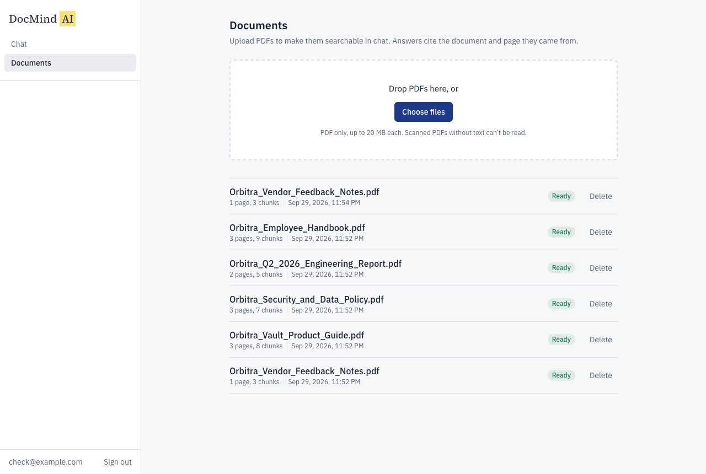
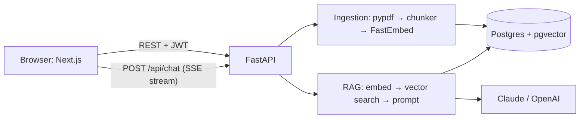

# DocMind AI

Upload PDFs and ask questions about them. Answers stream in token by token and cite the exact document and page they came from. If the documents don't contain the answer, DocMind says so instead of guessing.

DocMind is a retrieval-augmented generation (RAG) app: FastAPI + PostgreSQL/pgvector on the backend, Next.js on the frontend, local embeddings, and Anthropic Claude or OpenAI for answers.



## Features

- **Accounts:** email + password (bcrypt), JWT access tokens.
- **PDF upload:** drag and drop, multiple files, 20 MB each; validated by extension, MIME type and `%PDF` magic bytes.
- **Background ingestion:** text extraction → chunking → local embeddings, with live status (`processing` / `ready` / `failed`).
- **Streaming answers:** token by token over Server-Sent Events, with a Stop button and Markdown rendering.
- **Citations:** clickable `[1]` markers and chips such as `Orbitra_Vault_Product_Guide.pdf · p.1` that open the source passage.
- **Grounded refusals:** says "not found" instead of guessing; skips the LLM entirely when nothing relevant is retrieved.
- **Conversations:** saved history, follow-up questions, optional filter by document.
- **Security:** per-user data isolation, rate limits, prompt-injection defences, security headers, structured logs.

## Tech stack

| Layer | Technology |
|---|---|
| Frontend | Next.js 16 (App Router), React 19, TypeScript (strict), Tailwind CSS 4 |
| Backend | Python 3.12, FastAPI, Pydantic v2, SQLAlchemy 2 (async), Alembic |
| Database | PostgreSQL 16 + pgvector (HNSW index, cosine distance) |
| Embeddings | FastEmbed `BAAI/bge-small-en-v1.5` (runs locally, no API key) |
| LLM | Anthropic Claude (default) or OpenAI, selected in `.env` |



More detail: [Architecture](docs/ARCHITECTURE.md) · [Design decisions](docs/DECISIONS.md) · [API reference](docs/API.md).

---

## Prerequisites

| Requirement | Version | Notes |
|---|---|---|
| Git | any | to clone the repo |
| Docker Desktop (macOS/Windows) or Docker Engine (Linux) | Docker 24+ with Compose v2.20+ | check with `docker --version` and `docker compose version` |
| `make` | any | preinstalled on macOS/Linux; on Windows use WSL2 |
| An LLM API key | — | Anthropic **or** OpenAI; see [Get an API key](#get-an-api-key) |
| Free resources | ~4 GB RAM, ~4 GB disk | for the images and the embedding model |

- **Windows:** install [WSL2](https://learn.microsoft.com/windows/wsl/install) and Docker Desktop with WSL integration, then run every command inside the WSL terminal.
- **No API key yet?** You can still try the app offline with `LLM_PROVIDER=fake`: answers are then just quoted passages.
- Python and Node are **not** required unless you want to run the app outside Docker (see [Local development](#local-development-without-docker)).

## Get an API key

You need **one** of these.

### Anthropic (Claude), the default

1. Sign in at [console.anthropic.com](https://console.anthropic.com).
2. Go to **Settings → Billing** and add credits. Keys don't work on an account with no credits.
3. Go to **Settings → API Keys → Create Key** and copy the key (it starts with `sk-ant-`).
4. Available model names: [docs.anthropic.com → Models overview](https://docs.anthropic.com/en/docs/about-claude/models/overview).

### OpenAI

1. Sign in at [platform.openai.com](https://platform.openai.com).
2. Go to **Settings → Billing** and add a payment method or credits.
3. Go to **API keys → Create new secret key** and copy it (it starts with `sk-`).
4. Available model names: [platform.openai.com/docs/models](https://platform.openai.com/docs/models).

> Keep keys only in `.env`. It's git-ignored, and the key is used by the backend only; it never reaches the browser or the model's prompt.

## Choose the provider and model

Set these in `.env`:

| Variable | What it does | Example |
|---|---|---|
| `LLM_PROVIDER` | Which provider to call | `anthropic`, `openai`, or `fake` (offline demo) |
| `LLM_MODEL` | Model name from the provider's models page | `claude-opus-5-5` |
| `ANTHROPIC_API_KEY` | Required when `LLM_PROVIDER=anthropic` | `sk-ant-...` |
| `OPENAI_API_KEY` | Required when `LLM_PROVIDER=openai` | `sk-...` |
| `LLM_EFFORT` | Anthropic only: reasoning depth (`low`, `medium`, `high`, `xhigh`, `max`). Leave blank for models that don't support it | `low` |
| `LLM_FALLBACKS_ENABLED` | Anthropic only: retry on a fallback model if a request is declined by a safety check | `true` |
| `LLM_MAX_TOKENS` | Maximum answer length (limits cost) | `1024` |

Example configurations:

```bash
# Anthropic — most capable
LLM_PROVIDER=anthropic
LLM_MODEL=claude-opus-5-5
LLM_EFFORT=low

# Anthropic — faster and cheaper
LLM_PROVIDER=anthropic
LLM_MODEL=claude-sonnet-5-5
LLM_EFFORT=low

# Anthropic — smallest model (does not support effort or fallbacks)
LLM_PROVIDER=anthropic
LLM_MODEL=claude-haiku-4-5
LLM_EFFORT=
LLM_FALLBACKS_ENABLED=false

# OpenAI — use any current chat model name from OpenAI's models page
LLM_PROVIDER=openai
LLM_MODEL=<model-name>
OPENAI_API_KEY=sk-...
```

After changing `.env`, restart the backend: `docker compose up -d backend`.

---

## Install and run (Docker, recommended)

1. **Clone the repository**

   ```bash
   git clone <your-repo-url> docmind-ai
   cd docmind-ai
   ```

2. **Create your config file**

   ```bash
   cp .env.example .env
   ```

3. **Edit `.env`**
   - Set your API key (`ANTHROPIC_API_KEY` or `OPENAI_API_KEY`) and choose `LLM_PROVIDER` / `LLM_MODEL` (see above).
   - Set `JWT_SECRET` to a long random string. Generate one with:

     ```bash
     python3 -c "import secrets; print(secrets.token_urlsafe(48))"
     ```

   - Optional: change ports if 3000, 8000 or 5433 are in use (see [Ports](#ports)).

4. **Build and start everything**

   ```bash
   make up
   ```

   This builds the images (first run takes a few minutes), starts Postgres, the backend and the frontend, runs database migrations, and waits until all services are healthy.

5. **Load the sample documents** (optional but recommended)

   ```bash
   make seed
   ```

   This creates the demo user `demo@docmind.dev` / `Demo@12345` and ingests the five PDFs in `sample-docs/`.

6. **Open the app**
   - App: <http://localhost:3000>. Sign in as the demo user, or register a new account.
   - API docs (Swagger): <http://localhost:8000/docs>
   - Health check: <http://localhost:8000/api/health>

7. **Stop or reset**

   ```bash
   make down                 # stop (keeps your data)
   docker compose down -v    # stop and DELETE all data (database + uploaded files)
   ```

### Without `make`

Every `make` target is a thin wrapper. The equivalents:

| `make` | Command |
|---|---|
| `make up` | `docker compose up -d --build --wait` |
| `make seed` | `docker compose exec backend python /scripts/seed.py` |
| `make logs` | `docker compose logs -f --tail=100` |
| `make migrate` | `docker compose exec backend alembic upgrade head` |
| `make test-backend` | `docker compose exec backend pytest -q -p no:cacheprovider` |

### Ports

| Service | Default | `.env` variable |
|---|---|---|
| Frontend | 3000 | `FRONTEND_PORT` |
| Backend API | 8000 | `BACKEND_PORT` |
| PostgreSQL (from your machine) | 5433 | `DB_PORT` |

If you change the frontend or backend port, update these to match, then run `make up` again. The frontend image must be rebuilt because the API URL is compiled into it.

```bash
CORS_ORIGINS=http://localhost:<FRONTEND_PORT>
NEXT_PUBLIC_API_URL=http://localhost:<BACKEND_PORT>
```

## Local development (without Docker)

Use this to get hot reload while coding. The database still runs in Docker.

**Also requires:** Python 3.11+ and Node.js 24+.

1. **Start only the database**

   ```bash
   cp .env.example .env    # if you haven't already; set your API key
   docker compose up -d db
   ```

2. **Backend** (in one terminal)

   ```bash
   cd backend
   python3 -m venv .venv
   source .venv/bin/activate          # Windows (WSL): same command
   pip install -r requirements-dev.txt
   alembic upgrade head
   uvicorn app.main:app --reload --port 8000
   ```

   The backend reads the root `.env`. `DATABASE_URL` already points at the database on `localhost:5433`. The embedding model (~130 MB) downloads on first start.

3. **Frontend** (in a second terminal)

   ```bash
   cd frontend
   npm ci
   NEXT_PUBLIC_API_URL=http://localhost:8000 npm run dev
   ```

   Open <http://localhost:3000>. `CORS_ORIGINS` in `.env` must include `http://localhost:3000`.

4. **Sample data**

   ```bash
   API_BASE_URL=http://localhost:8000 backend/.venv/bin/python scripts/seed.py
   ```

## Access the database

Postgres runs in the `db` container. The default credentials come from `.env` (`POSTGRES_USER`, `POSTGRES_PASSWORD`, `POSTGRES_DB`).

**Command line (no install needed):**

```bash
docker compose exec db psql -U docmind -d docmind
```

**GUI client** (TablePlus, DBeaver, pgAdmin, DataGrip, VS Code extension):

| Setting | Value |
|---|---|
| Host | `localhost` |
| Port | `5433` (your `DB_PORT`) |
| Database | `docmind` |
| User / password | `docmind` / `docmind` |

**Useful queries:**

```sql
\dt                                                   -- list tables
SELECT id, email, created_at FROM users;
SELECT filename, status, page_count, chunk_count, error_message FROM documents;
SELECT d.filename, c.page_number, c.chunk_index, left(c.content, 80)
  FROM chunks c JOIN documents d ON d.id = c.document_id
  ORDER BY d.filename, c.chunk_index;
SELECT title, updated_at FROM conversations ORDER BY updated_at DESC;
SELECT role, left(content, 100), citations FROM messages ORDER BY created_at DESC LIMIT 10;
```

Tables: `users`, `documents`, `chunks` (with the `embedding vector(384)` column), `conversations`, `messages`. Tests use a separate database, `docmind_test`.

## Tests, lint and evaluation

| Command | What it does |
|---|---|
| `make test` | All tests: backend (pytest, in the backend container, real Postgres, LLM mocked) and frontend (Vitest) |
| `make lint` | ruff + black (Python), ESLint + Prettier + `tsc` (TypeScript) |
| `make eval` | Asks the 22 questions in `sample-docs/test-questions.md` via the running app (uses your API key) and writes [docs/EVAL_RESULTS.md](docs/EVAL_RESULTS.md) |
| `make study-guide` | Builds the full and short interview study guides (PDF) in `docs/` |

Where the tests live:

| Path | Covers |
|---|---|
| `backend/tests/test_auth.py` | register/login/me, JWT attacks (expired, forged, `alg: none`) |
| `backend/tests/test_chunker.py` | PDF parsing, header stripping, chunk size/overlap, no cross-page chunks |
| `backend/tests/test_documents.py` | upload → ingestion → ready, delete cascade, cross-user access (IDOR) |
| `backend/tests/test_chat.py` | SSE event order, citations, "not found" path, follow-ups, Stop, conversation IDOR |
| `backend/tests/test_security.py` | upload validation, filename sanitizing, prompt-injection defences |
| `backend/tests/test_hardening.py` | rate limits, error format, security headers, CORS, LLM error mapping |
| `backend/tests/test_eval_scoring.py` | the eval script's grading logic |
| `backend/tests/conftest.py`, `helpers.py` | test database setup, fake embedder, tiny PDF builder |
| `frontend/src/lib/sse.test.ts` | streaming (SSE) parser |
| `frontend/src/components/MessageBubble.test.tsx` | Markdown rendering, citation chips, no HTML injection |

CI (`.github/workflows/ci.yml`) runs lint, migrations and all tests, plus a production build, on every push and pull request.

## Troubleshooting

| Symptom | Fix |
|---|---|
| `port is already allocated` on `make up` | Change `FRONTEND_PORT` / `BACKEND_PORT` / `DB_PORT` in `.env` (see [Ports](#ports)) |
| Chat says "account has run out of credits" | Add credits in your provider's billing page |
| Chat says "AI provider is not configured" | Check `LLM_PROVIDER` and that the matching `*_API_KEY` is set; restart with `docker compose up -d backend` |
| Chat says "configured AI model isn't available" | `LLM_MODEL` is misspelled or not enabled for your account |
| Frontend loads but API calls fail | `NEXT_PUBLIC_API_URL` / `CORS_ORIGINS` don't match your ports; run `make up` again after fixing |
| A document shows `failed` | See its error message. Scanned (image-only) or password-protected PDFs aren't supported yet |
| Start from scratch | `docker compose down -v && make up && make seed` |
| See what's happening | `make logs` (JSON logs; each response carries an `X-Request-ID` you can search for) |

## Project structure

```
backend/        FastAPI app
  app/api/        routes (auth, documents, chat, health) and dependencies
  app/services/   pdf_parser, chunker, embeddings, retriever, prompts, llm, rag, ingestion
  app/db/         SQLAlchemy models and session
  app/core/       config, security, logging, errors, rate limiting
  alembic/        database migrations
  tests/          pytest suite
frontend/       Next.js app
  src/app/        pages: login, register, documents, chat
  src/components/ UI components
  src/hooks/      useChatStream (streaming chat)
  src/lib/        API client, SSE parser, auth store
scripts/        seed.py, eval.py, build_study_guide.py
sample-docs/    five fictional PDFs + the evaluation question set
docs/           architecture, decisions, API, eval results, study guides
```

## Roadmap

- **Hybrid search** (keyword + vector, merged with Reciprocal Rank Fusion): better on acronyms and codes.
- **Reranker:** more precise top results and a more reliable "not found".
- **Follow-up question rewriting** for long conversations.
- **Durable ingestion queue** (Redis + workers) with retries.
- **httpOnly cookie sessions** with refresh tokens.
- **OCR** for scanned PDFs.
- **Answer feedback** (thumbs up/down) and a semantic cache.

## Contributing

1. Fork the repo and create a branch: `git checkout -b feat/my-change`.
2. Make your change with tests.
3. Run `make lint` and `make test`.
4. Commit using [Conventional Commits](https://www.conventionalcommits.org) (`feat:`, `fix:`, `docs:` …) and open a pull request.

Please don't commit `.env` files or API keys.

## License

A license has not been chosen yet. Add a `LICENSE` file (for example MIT or Apache-2.0) before publishing.
