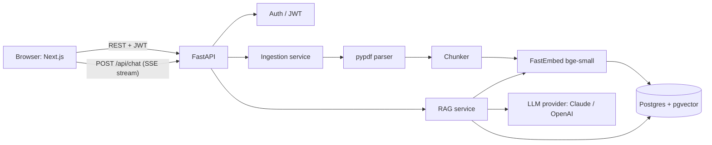
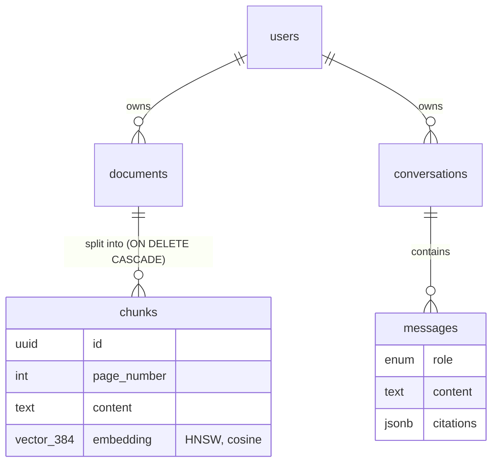
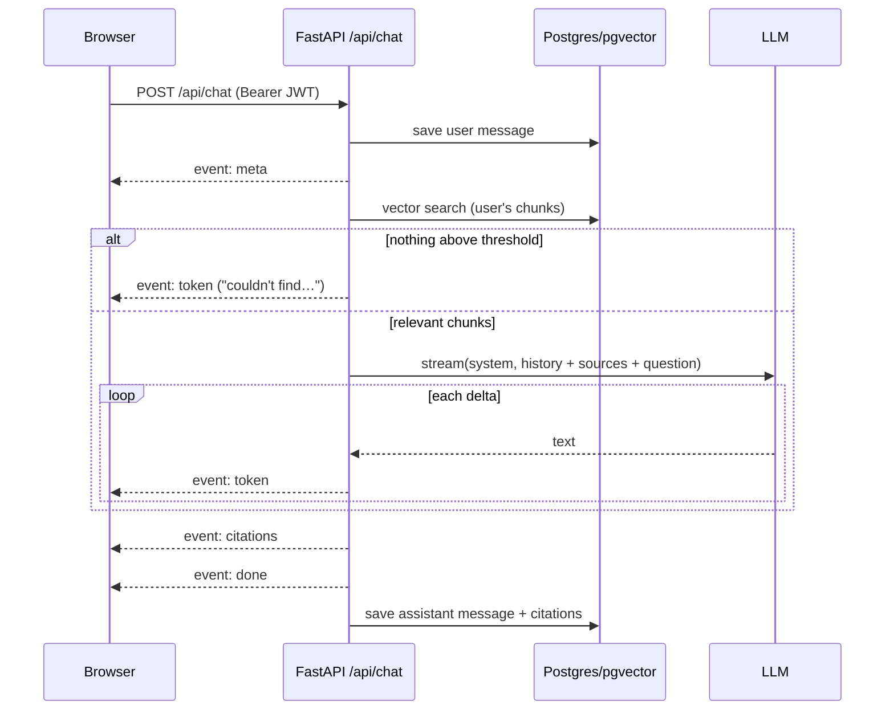

# Architecture

DocMind AI is a three-tier web app: a Next.js frontend, a FastAPI backend, and PostgreSQL with pgvector. The backend runs the whole AI pipeline itself — PDF parsing, chunking and embeddings are local; only answer generation calls an external LLM.

## Layers

| Layer | Location | Responsibility |
|---|---|---|
| Routes | `backend/app/api/routes/` | HTTP concerns only: validation, auth dependency, status codes, SSE framing |
| Dependencies | `backend/app/api/deps.py` | `get_db` (session per request), `get_current_user` (JWT → `User`) |
| Services | `backend/app/services/` | Business logic: ingestion, retrieval, prompting, LLM streaming, RAG orchestration |
| Data | `backend/app/db/` | SQLAlchemy models, async engine and session factory |
| Core | `backend/app/core/` | Settings, security (bcrypt/JWT), JSON logging, error shape, rate limiting |

Routes call services; services call the database and providers. Providers (`EmbeddingProvider`, `LLMProvider`) are interfaces, so implementations can be swapped via configuration.

## Data model

Authorization follows the ownership chain: every query on documents, chunks, conversations or messages joins back to `user_id` inside SQL. A resource owned by someone else returns 404, never 403.

## Ingestion flow

1. **Upload** — `POST /api/documents` (`backend/app/api/routes/documents.py::upload_documents`), rate-limited 10/min per user.
2. **Validate** — `backend/app/utils/upload_validation.py`: `.pdf` extension, `application/pdf` MIME type, `%PDF-` magic bytes, size ≤ `MAX_UPLOAD_MB` (read with a `max+1` cap), ≤ 10 files. The whole batch is validated before anything is stored.
3. **Store** — `backend/app/utils/storage.py::save_upload` writes `<uuid>.pdf`; the user's filename is sanitized and kept only as metadata.
4. **Create rows** — one `documents` row per file with `status=processing`; respond **202 Accepted**.
5. **Background task** — `backend/app/services/ingestion.py::ingest_document` runs after the response, with its own DB session:
   1. `pdf_parser.parse_pdf` (in a worker thread): page-by-page text via pypdf, whitespace normalization, removal of running headers/footers; empty pages skipped; scanned/encrypted PDFs fail with a clear message.
   2. `chunker.chunk_pages`: recursive splitting (paragraph → line → sentence → word) to ≤ 800 chars with 150 chars of overlap, per page (a chunk never spans pages).
   3. `embeddings.FastEmbedProvider.embed_documents` in batches of 32 (in a worker thread); each chunk is embedded as `"<document title>\n<chunk>"`.
   4. Bulk insert of all chunks and `status=ready` in **one transaction**; any exception sets `status=failed` with a user-safe `error_message`.
6. **Poll** — the Documents page polls `GET /api/documents` every 2 s while anything is `processing` (`frontend/src/app/documents/page.tsx`).

On startup, `fail_stale_processing_documents` marks documents left in `processing` by a restart as failed.

## Chat flow

1. **Request** — `frontend/src/hooks/useChatStream.ts` POSTs `{conversation_id?, message, document_ids?}` to `/api/chat` with `fetch` and reads the body as a stream (`frontend/src/lib/sse.ts`). An `AbortController` backs the Stop button.
2. **Pre-stream checks** — `backend/app/api/routes/chat.py::chat`: JWT, body validation (≤ 4,000 chars), rate limit 20/min per user, conversation ownership (404 otherwise). A new conversation is created with a title from the question.
3. **Stream** — `backend/app/services/rag.py::answer_stream` yields events that the route frames as SSE:
   1. Load the last `HISTORY_MESSAGES` (6) messages, save the user message, emit **`meta`** `{conversation_id, message_id}`.
   2. **Retrieve** — `retriever.retrieve`: embed the question (with the BGE query instruction), `ORDER BY embedding <=> :q LIMIT TOP_K` joined to the user's `ready` documents (optionally filtered by `document_ids`), then drop results below `MIN_SIMILARITY` (0.45). For follow-ups, a second search with the previous question prepended is merged in.
   3. **Nothing relevant?** Emit a fixed "couldn't find it in your documents" answer as a `token` — **the LLM is not called**.
   4. Otherwise **prompt** — `prompts.format_sources` renders numbered `<source id file page>` blocks (delimiter look-alikes inside chunks are neutralized, total ≤ 12,000 chars); `prompts.build_messages` adds history plus the grounded user turn; `prompts.SYSTEM_PROMPT` holds the grounding, citation and anti-injection rules.
   5. **Generate** — `llm.LLMProvider.stream` (Anthropic by default: `claude-opus-5-5`, effort `low`, `max_tokens` 1024, 60 s timeout, SDK retries with backoff before the stream starts, server-side refusal fallback). Each text delta becomes a **`token`** event.
   6. **Citations** — `rag.build_citations` keeps only sources referenced as `[n]` in the answer → **`citations`** event, then **`done`**. Provider failures become an **`error`** event with a stable code (`LLM_TIMEOUT`, `LLM_RATE_LIMITED`, …).
   7. **Persist** — the assistant message and its citations are saved. If the client disconnects or presses Stop, the partial answer is saved inside a shielded cancel scope.
4. **Render** — `frontend/src/components/MessageBubble.tsx` renders Markdown (no raw HTML), turns `[n]` into clickable markers, and shows `CitationChip`s; clicking one opens `SourcePanel`, which fetches `GET /api/chunks/{id}`.

### SSE event sequence

## Cross-cutting concerns

- **Configuration** — `backend/app/core/config.py` (pydantic-settings); every knob is an env var documented in `.env.example`.
- **Logging** — JSON lines with a per-request ID (`backend/app/core/logging.py`, middleware in `backend/app/main.py`). The `chat_turn` log records chunks retrieved, retrieval/LLM latency, first-token time, token usage and whether the LLM was called. Passwords and document contents are never logged.
- **Errors** — one shape `{"error": {"code", "message"}}` (`backend/app/core/errors.py`); unhandled exceptions return a generic 500.
- **Security headers** — strict CSP and anti-framing headers on the API; a Next.js CSP with `connect-src` limited to the API (`frontend/next.config.ts`).
- **Rate limits** — slowapi, keyed per user (or per IP when anonymous) (`backend/app/core/rate_limit.py`).

## Deployment (Docker Compose)

`docker-compose.yml` runs `db` (pgvector/pgvector:pg16, health-checked, named volume), `backend` (multi-stage image with the embedding model baked in; runs `alembic upgrade head` then uvicorn; non-root) and `frontend` (Next.js standalone output; non-root). Uploaded files live in the `uploads` volume.
